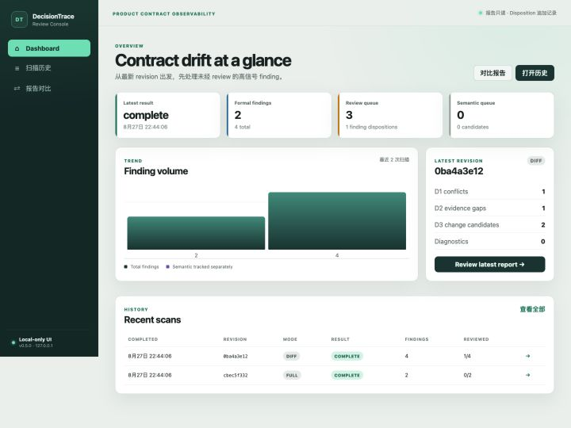
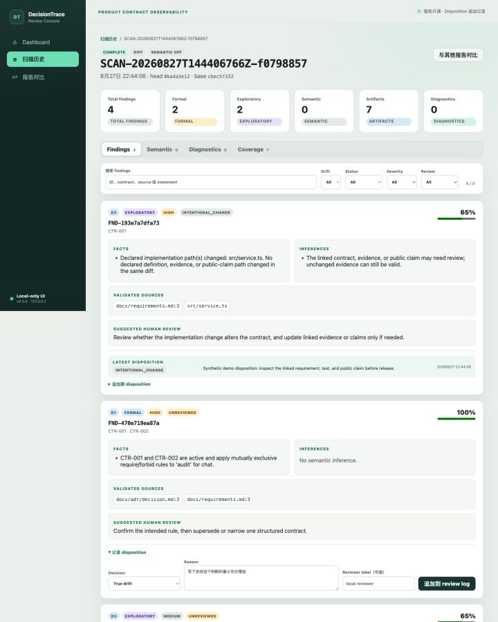
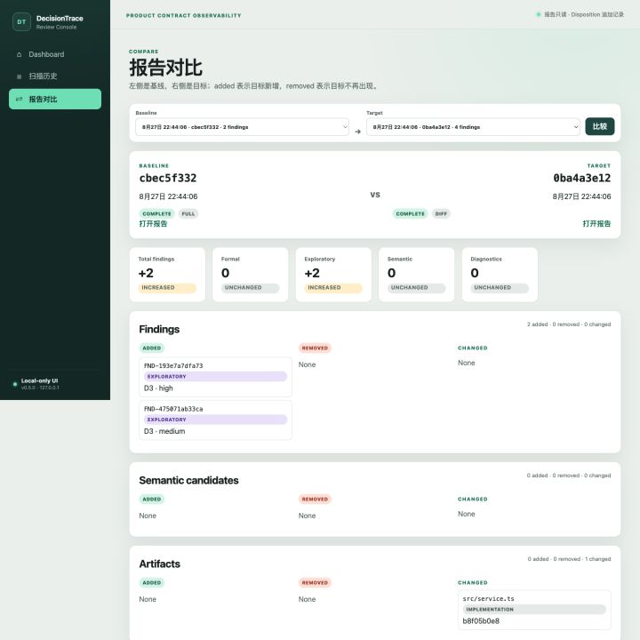
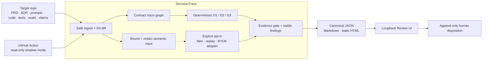

# DecisionTrace

[](https://github.com/Jeffreyliu0131/DecisionTrace/actions/workflows/ci.yml?query=branch%3Amain)
[](https://github.com/Jeffreyliu0131/DecisionTrace/actions/workflows/shadow.yml?query=branch%3Amain)

**Catch PRD–code–eval drift before release.**

DecisionTrace is a local-first CLI, GitHub Action, and Review UI that catches drift between product contracts, code, prompts, tests, evals, and release claims. Every finding cites its evidence and enters a human review queue. Optional AI analysis can suggest candidates, but it cannot silently change a contract or block a release.

<p align="center">
  <a href="#quick-start">Quick start</a> ·
  <a href="#review-workflow">See the UI</a> ·
  <a href="#first-real-public-dogfood">ThinkBud dogfood</a> ·
  <a href="#architecture">Architecture</a> ·
  <a href="#evidence-not-claims">Evidence</a>
</p>



## Quick start

Requirements: Git and Node.js 22.12+.

```bash
git clone https://github.com/Jeffreyliu0131/DecisionTrace.git
cd DecisionTrace
npm ci --ignore-scripts
npm run demo
```

`npm run demo` builds the product, creates a temporary synthetic Git repository, runs two scans, records one synthetic review, and opens the loopback-only Review UI on `127.0.0.1:4173`. It executes no target-repository scripts, makes no provider call, and deletes the temporary target after `Ctrl+C`.

## What DecisionTrace catches

AI coding increases implementation speed; it does not keep the PRD, ADRs, tests, evals, and release claims synchronized. DecisionTrace adds a read-only control loop beside the delivery path:

| Signal | What DecisionTrace proves | Output status |
|---|---|---|
| `D1` Decision Conflict | Two active structured contracts contain mutually exclusive rules | Formal when both sources are directly cited |
| `D2` Claim Without Evidence | Required evidence is missing or declared coverage is incomplete | Formal for file/coverage facts; not proof of test quality |
| `D3` Change-Induced Mismatch | A linked implementation changed while its requirement, evidence, and claim did not | Exploratory; unchanged evidence may still be valid |
| Semantic candidate | A redacted provider response suggests a claim, edge, or conflict | Exploratory only; human disposition required, never a gate |

Every finding separates facts from inference, cites validated source spans, preserves a stable ID, and asks for one of five human dispositions: true drift, intentional change, false positive, accepted risk, or insufficient evidence.

For a non-interactive verification:

```bash
npm run build
npm run demo:check
```

The synthetic demo deliberately produces two formal findings (`D1`, `D2`) and two exploratory `D3` candidates so the UI exposes the facts/inference and formal/exploratory boundaries instead of showing a staged empty state.

## Review workflow

| Evidence-linked review | Stable report comparison |
|---|---|
|  |  |

The loopback-only React UI provides Dashboard, scan history, finding/semantic filters, append-only dispositions, and stable-ID/hash comparison. It never starts a scan, rewrites a report, opens a LAN listener, or loads a CDN/runtime asset.

## Scan a configured repository

```bash
npm run build

node dist/cli/main.js scan \
  --repo /path/to/target-repo \
  --base <base-commit> \
  --head <checked-out-head-commit> \
  --semantic off \
  --output .decisiontrace/reports/review

node dist/cli/main.js ui --repo /path/to/target-repo
```

The target owns `.decisiontrace.yml` and `.decisiontrace/contracts.yml`; `decisiontrace init` creates minimal local-only starters. Reports are canonical JSON plus Markdown and static HTML.

## First real public dogfood

The first read-only target is [`Jeffreyliu0131/thinkbud-ai`](https://github.com/Jeffreyliu0131/thinkbud-ai), pinned to exact range `43976c4...5a36aac`. DecisionTrace ran local-only with semantic mode off and executed no target scripts.

- [Human-readable sample report](examples/dogfood/thinkbud-ai/sample/report.md)
- [Analyst triage and detector limitations](examples/dogfood/thinkbud-ai/analysis.md)
- [Reproduction inputs and provenance](examples/dogfood/thinkbud-ai/README.md)

Observed result: three formal `D2` evidence findings. One exposes a missing dedicated RTC-default regression evidence mapping; the other two reproduce limitations the target already declares (fresh live/human evidence and licensing). This is a configuration-dependent dogfood result, not real-repository precision: no independent reviewer has dispositioned it, and D2 currently verifies declared file/coverage presence rather than the semantic truth of JSON values.

## Architecture



The Deterministic Core is network-free. The only outbound semantic path requires an explicit `local|cloud` mode, a repo-contained config with model/prices/per-request budget, and a dedicated `DECISIONTRACE_*` key. It applies redaction, timeout, no-redirect/no-retry, response-byte, token, cost, schema, and source-binding checks. See the [BYOK protocol and placeholder config](examples/semantic/README.md). No real provider call or provider-quality calibration has been performed.

## GitHub Action

Pin the last green product commit rather than a mutable branch:

```yaml
permissions:
  contents: read

steps:
  - uses: actions/checkout@11d5960a326750d5838078e36cf38b85af677262 # v4
    with:
      persist-credentials: false
      fetch-depth: 0
      ref: ${{ github.event.pull_request.head.sha }}
  - uses: actions/setup-node@49933ea5288caeca8642d1e84afbd3f7d6820020 # v4
    with:
      node-version: 22
  - uses: Jeffreyliu0131/DecisionTrace@b7085cde1f96ae7eb0086687d723d64f5e332ee8
    with:
      repository: .
      base: ${{ github.event.pull_request.base.sha }}
      head: ${{ github.event.pull_request.head.sha }}
      output: .decisiontrace/reports/github-action
```

The Action uploads the report and preserves the CLI status. Current main remains shadow-first; semantic findings never gate. Official Actions are SHA-pinned inside this repository.

## Evidence, not claims

| Capability | Public evidence | Boundary still open |
|---|---|---|
| CLI, D1/D2/D3, reports, review | [`npm run check`](package.json), generated schemas, fixture tests | Synthetic structures do not prove field usefulness |
| Deterministic evaluation | [30-case baseline](fixtures/baseline/eval-report.md) | `EV-029` known rename false positive; E1 awaits an independent reviewer |
| Hosted execution | [CI](https://github.com/Jeffreyliu0131/DecisionTrace/actions/workflows/ci.yml?query=branch%3Amain) and [Synthetic Shadow Scan](https://github.com/Jeffreyliu0131/DecisionTrace/actions/workflows/shadow.yml?query=branch%3Amain) | Synthetic shadow is not external adoption |
| Local Review UI | Reproducible demo plus the synthetic screenshots above | No multi-user/hosted workflow study |
| Public dogfood | Exact-revision thinkbud report, hashes, provenance, and analyst triage | No independent disposition or real-repo precision |
| Semantic layer | Fake/replay and injected-fetch BYOK contract tests | No live provider, billing calibration, or semantic precision |

## Deliberate failure boundaries

- No evidence means abstain or exploratory; model text cannot become a formal fact.
- D2 proves declared evidence presence/coverage, not that an assertion validates runtime behavior.
- D3 is a review candidate, not an accusation that documentation is stale.
- Missing key, timeout, invalid/stale response, credential echo, or budget breach preserves deterministic findings and abstains from semantic output.
- Reports and review logs do not prove user value, time saved, adoption, or market demand.
- Public repository does not mean open source; license selection remains an explicit owner decision.

## Engineering contracts

- [`AGENTS.md`](AGENTS.md) — collaboration, evidence, safety, and publication protocol
- [`docs/01-PRD.md`](docs/01-PRD.md) — users, scope, requirements, and milestones
- [`docs/02-ARCHITECTURE.md`](docs/02-ARCHITECTURE.md) — modules, trust boundaries, and failure behavior
- [`docs/03-EVALUATION.md`](docs/03-EVALUATION.md) — ground truth, metrics, bad cases, and release gates
- [`docs/05-TECHNICAL-SPEC.md`](docs/05-TECHNICAL-SPEC.md) — CLI, schemas, detectors, BYOK, and UI contracts
- [`docs/06-ACCEPTANCE-CRITERIA.md`](docs/06-ACCEPTANCE-CRITERIA.md) — observable Given/When/Then acceptance
- [`docs/07-IMPLEMENTATION-PLAN.md`](docs/07-IMPLEMENTATION-PLAN.md) — completed slices and next evidence gaps

Current version: `0.5.0`. Current blockers: independent fixture review, real provider calibration, second-repo repeat use, external users, and license selection.
